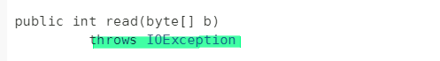

### 예외

  * 프로그램 실행 중에 발생하는 예기치 않은 상황
  * Exception 클래스는 다양한 예외를 처리하기 위해 정의됩니다.
  * 하위 클래스(자식 클래스)는 예외의 종류에 따라 분류 됩니다.
  
  #### Exception 상속 관계

  

  #### NumberFormatException 상속 관계
  

  #### FileNotFoundException 상속 관계
  
  
  * Checked Exception  : 
    * 반드시 try {} catch{} 또는 throws 로 예외 처리가 강제됩니다.
    * IOException : 입출력 예외
  
  * UnChecked Exception :
    * 예외처리가 강제 되지 않습니다.
    * RuntimeException : 실행 중에 잘못된 값으로 발생하는 예외.  
    