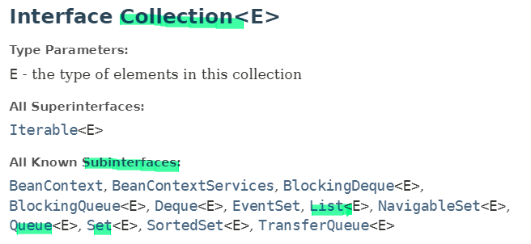
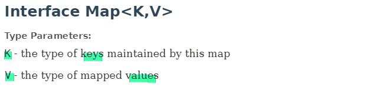

### 자료 구조

- Data Structure. 데이터를 저장하고 관리하는 방식이 다양합니다.
  - 데이터 조작 - 추가, 삭제, 수정
  - 데이터 조회

#### 1. Collection 인터페이스

- List

  - ArrayList
  - LinkedList
  - Vector

- Set
  - HashSet
  - LinkedSet
  - TreeSet

#### 2. Map 인터페이스

- Map
  - HashMap
  - LinkedHashMap
  - TreeMap
